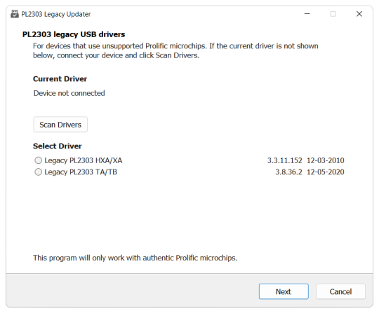

# PL2303 Legacy Driver Updater

- For authentic Prolific PL2303 HXA/XA and TA/TB microchips
- Supports Windows 10 (x86, x64) and Windows 11 (x64)

Download [PL2303 Legacy Updater Setup][release]. This allows you to run the updater program (shown
above) and check that a legacy driver works for your device.

If everything is okay, you are recommended to continue with the installation because you will need
this program again if Windows Update changes your driver, or if you use other devices that require a
different PL2303 driver. See [Program details](#program-details) for more information.

Once it has been installed, just type "PL2303" into the Taskbar search control to run it.

## Supplied drivers

Legacy drivers are provided for the following microchips:

### PL2303 HXA/XA

| Version    | Date       | Support ended |
|------------|------------|---------------|
| 3.3.11.152 | 12-03-2010 | Windows 8     |

PL2303HXA and PL2303XA were phased out in 2012 due to counterfeit Chinese copies. Note that this
driver will only be installed if Prolific recognizes the microchip.

This driver also supports older microchips (PL2303H, PL2303HX and PL2303X). If it is not suitable
you can try the excellent [Prolific PL-2303 Code 10 Fix][codefix] program from
[Family Software][family], which uses an earlier driver version (3.3.2.102) from 2008. Older
applications sometimes fail to write to the device, so using an earlier driver may
solve this.

### PL2303 TA/TB

| Version  | Date       | Support ended |
|----------|------------|---------------|
| 3.8.36.2 | 12-05-2020 | Windows 11    |

PL2303TA and PL2303TB were both recommended by Prolific as replacements for the above end-of-life
microchips. Unfortunately support for these ended with the release of Windows 11, presumably for a
similar reason.

This driver can identify non-Prolific microchips and unsupported versions and will display a
readable message in Windows Device Manager.

## Program details

The program does not uninstall any existing PL2303 drivers. Instead it requires that your device is
connected so it can instruct Windows to use the selected driver for this specific device.

Windows stores these device/driver/COM port configurations for the next time you connect, so it is
possible to have a different device on another COM port using a different PL2303 driver.

But preserving this configuration cannot be guaranteed, so rather than fight against Windows
Update (or the internal ranking of which driver to use), it is recommended to install this
program so that you can run it again when you need to.

[codefix]:  https://www.ifamilysoftware.com/Prolific_PL-2303_Code_10_Fix.html
[family]:   https://www.ifamilysoftware.com/
[release]:  https://github.com/johnstevenson/pl2303-legacy/releases/latest
